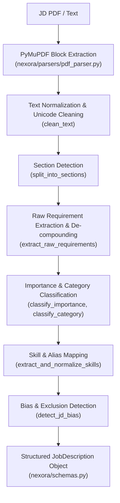
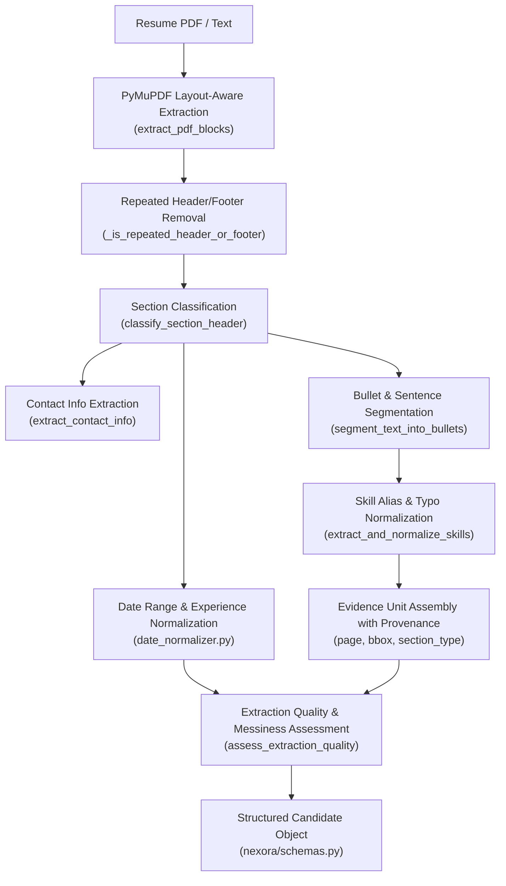

# 03_PERSON_2_PARSING_INTELLIGENCE.md

## NEXORA: Document Intelligence & Parsing Layer
**Author**: Person 2  
**Role**: Document Intelligence, Parsing & Normalization Engineer  
**Status**: Implemented & Verified  

---

## 1. Mission & Scope

Person 2 is responsible for building the local, offline document intelligence layer that ingests Job Description and Resume PDFs and converts them into high-fidelity, explainable structured data objects (`JobDescription` and `Candidate`).

This layer provides the foundational structured inputs consumed by downstream modules:
- **Person 1 (Matching Engine)**: Relies on canonical skills, classified JD requirements (required vs. preferred vs. contextual), experience durations, and granular evidence units with provenance for keyword and semantic matching.
- **Person 3 (Explanations & Ranking)**: Uses evidence units, page numbers, and exact sentence snippets to generate factual justifications for why candidates rank above or below one another.
- **Person 4 (Streamlit UI)**: Visualizes extraction quality scores, parse warnings, normalization logs (e.g. typos corrected like `pyhton` → `Python`), and JD bias flags.

---

## 2. File Ownership Boundaries

### Exact Files Owned by Person 2
| Path | Component | Responsibility |
|---|---|---|
| `nexora/parsers/pdf_parser.py` | Local PDF Extractor | PyMuPDF block extraction, repeated header/footer elimination, ligature cleaning, messy document quality scoring. |
| `nexora/parsers/section_normalizer.py` | Section Categorizer | Fuzzy and token-based detection of standard resume and JD section headings. |
| `nexora/parsers/date_normalizer.py` | Date & Duration Normalizer | Extracts date ranges (`Jan 2021 - Present`), resolves relative dates, merges overlapping intervals, and computes duration in months. |
| `nexora/parsers/evidence_builder.py` | Evidence & Candidate Builder | Segments sections into discrete evidence units, extracts contact info, tags canonical skills via aliases/typo matching, attaches provenance, and constructs `Candidate`. |
| `nexora/jd_analysis/requirement_extractor.py` | JD Phrase Extractor | Extracts requirement clauses, de-compounds multi-part phrases, and parses numerical experience and degree constraints. |
| `nexora/jd_analysis/requirement_classifier.py` | JD Requirement Classifier | Classifies requirement importance (`required`/`preferred`/`contextual`), categorizes requirement type, attaches canonical skills, and constructs `JobDescription`. |
| `nexora/jd_analysis/bias_detector.py` | JD Bias & Inclusion Engine | Detects gender-coded terms, ageist phrases, elitist degree filters, and unrealistic technology tenure requirements with explanations. |
| `data/aliases.json` | Knowledge Base | Comprehensive mapping of skill aliases, acronyms, and common misspellings to canonical skill names. |
| `data/ontology.json` | Knowledge Base | Technology taxonomy and relational hierarchy (parent/child relationships and related technology graphs). |
| `tests/test_parser.py` | Verification Suite | Comprehensive Pytest suite covering all parsing, normalization, extraction, and bias detection features. |

### Shared Schemas (`nexora/schemas.py`)
Person 2 complies with the shared Pydantic data contracts:
- `JobDescription`
- `Candidate`
- `EvidenceUnit`
- `JDRequirement`
- `ParsedSection`
- `ExtractionQuality`
- `JDBiasFlag`
- `RequirementImportance`
- `RequirementCategory`
- `SectionType`

### Files Person 2 Does NOT Own or Modify
- `app.py` (Streamlit entrypoint)
- `nexora/ui/*` (Person 4 UI components)
- `nexora/matching/*` (Person 1 matching engine)
- `nexora/ranking/*` (Person 1/3 ranking)
- `nexora/explanations/*` (Person 3 explanation generator)

---

## 3. Authoritative Document Pipelines

### 3.1 Job Description Pipeline


### 3.2 Candidate Resume Pipeline


---

## 4. Normalization Rules & Implementation Details

### 4.1 Section Normalization
- Supports fuzzy matching and token subset matching across non-standard headers (e.g. `1. PROFESSIONAL BACKGROUND:`, `Core Competencies & Stack`, `What You'll Do`, `Nice to Haves`).
- Prioritizes specific phrases over general single-token words (e.g. `Preferred Qualifications` maps to `PREFERRED_QUALIFICATIONS`, while `Qualifications` alone maps to `REQUIREMENTS`).
- Canonical categories:
  - `SUMMARY`, `EXPERIENCE`, `EDUCATION`, `SKILLS`, `PROJECTS`, `CERTIFICATIONS`, `PUBLICATIONS`, `AWARDS`
  - `RESPONSIBILITIES`, `REQUIREMENTS`, `PREFERRED_QUALIFICATIONS`, `ABOUT`, `OTHER`

### 4.2 Date Normalization & Durations
- Handled formats:
  - `MMM YYYY - MMM YYYY` (e.g., `Jan 2021 - Present`, `September 2019 to August 2022`)
  - `MM/YYYY - MM/YYYY` (e.g., `03/2019 - 08/2021`)
  - `YYYY - YYYY` (e.g., `2018 - 2022`)
- Relative temporal resolution: Resolves `Present`, `Current`, `Ongoing`, `Now` relative to `CURRENT_YEAR` / `CURRENT_MONTH`.
- Overlapping interval handling: Merges overlapping roles to compute true non-overlapping total experience months.

### 4.3 Skill Aliases & Typo Normalization
- **Exact word-boundary mapping**: Regex boundary lookaround ensures words like `Go` or `R` don't trigger false positives inside `Google` or `React`.
- **Typo tolerance**: RapidFuzz ratio matching (threshold $\ge 88\%$) corrects common misspellings (`pyhton` $\to$ `Python`, `posgresql` $\to$ `PostgreSQL`, `kubernets` $\to$ `Kubernetes`).
- **Audit trail**: Every alias and typo substitution records a normalization log entry:
  ```json
  {
    "original": "pyhton",
    "canonical": "Python",
    "match_type": "typo_fuzzy_match",
    "confidence": 0.95,
    "unit_id": "ev_4"
  }
  ```

### 4.4 Header/Footer Stripping
- Identifies bounding boxes in the top 15% or bottom 15% margins of multi-page documents.
- Automatically removes page numbers matching `Page X of Y`, `X / Y`, or single digits, as well as short running headers.

### 4.5 Extraction Quality Diagnostics
- Assesses word density, alphanumeric character ratio, and unparsed/empty blocks.
- Computes a normalized `quality_score` (0.0 to 1.0) and sets `is_messy = True` if the document is scanned, noisy, or poorly extracted.

### 4.6 JD Requirement Classification
- **Importance Weights**:
  - `REQUIRED`: 1.0 weight (phrases like "must have", "minimum qualifications", "required")
  - `PREFERRED`: 0.5 weight (phrases like "nice to have", "bonus points", "preferred")
  - `CONTEXTUAL`: 0.25 weight (phrases like "exposure to", "familiarity with", "responsibilities")
- **Categories**:
  - `TECHNICAL_SKILL`, `EXPERIENCE_LEVEL`, `EDUCATION`, `DOMAIN_KNOWLEDGE`, `SOFT_SKILL`

### 4.7 Job Description Bias Detection
- **Gender-coded language**: Flags aggressive masculine archetypes (`rockstar`, `ninja`, `hacker`, `work hard play hard`) and suggests professional alternatives.
- **Ageist language**: Flags terms like `digital native`, `young and energetic`, `recent grads only`.
- **Elitist pedigree**: Flags arbitrary filters like `Ivy League only` or `top tier college only`.
- **Unrealistic tenure**: Flags impossible constraints like `15+ years of Kubernetes` (Kubernetes was released in 2014).

---

## 5. Verification & Testing

Person 2 is backed by a full test suite in `tests/test_parser.py`:
- 17 unit and integration tests.
- Covers in-memory synthetic multi-page PDFs with headers, footers, and realistic resumes.
- Verifies zero regressions across regexes, fuzzy matchers, provenance tracking, and schemas.

To execute tests:
```bash
python3 -m pytest tests/test_parser.py -v
```
Output:
```text
tests/test_parser.py::test_section_header_classification PASSED
tests/test_parser.py::test_is_likely_section_header PASSED
tests/test_parser.py::test_split_into_sections PASSED
tests/test_parser.py::test_extract_date_range PASSED
tests/test_parser.py::test_calculate_total_experience_months PASSED
tests/test_parser.py::test_clean_text PASSED
tests/test_parser.py::test_assess_extraction_quality PASSED
tests/test_parser.py::test_extract_and_normalize_skills PASSED
tests/test_parser.py::test_extract_contact_info PASSED
tests/test_parser.py::test_build_candidate_from_text PASSED
tests/test_parser.py::test_pdf_parser_with_synthetic_pdf PASSED
tests/test_parser.py::test_extract_years_of_experience PASSED
tests/test_parser.py::test_is_education_requirement PASSED
tests/test_parser.py::test_decompound_requirement_phrase PASSED
tests/test_parser.py::test_build_job_description_from_text PASSED
tests/test_parser.py::test_detect_jd_bias PASSED
tests/test_parser.py::test_clean_jd_bias_free PASSED
======================== 17 passed, 5 warnings in 0.26s ========================
```
